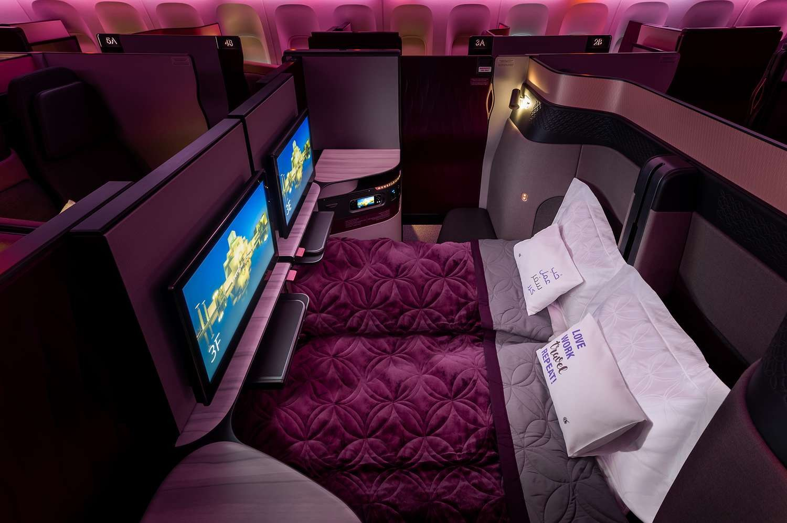

# How to Build a Dashboard Detail Page

A step-by-step walkthrough. Follow these in order. Reference mockups live in this folder
(`qa-dashboard-detail-mockup.html`, `option1-image`, `option2-description`, `option3-compact`) —
duplicate the closest variant rather than starting from a blank file.

---

## Step 1 — Gather inputs from the steward

Before you open a code editor, collect these from the dashboard owner. Don't proceed until every
field has a value.

| Input | Example | If missing |
|---|---|---|
| Dashboard title | OTP & Delay Analysis | Block — get from steward |
| Italic highlight word(s) | "Delay Analysis" | Block — pick the noun phrase |
| Category | Flight Ops | Must match an existing directory category |
| Owner (single human) | Aisha Rahman | Use department head as fallback |
| Department | IOC Control | Block — get from steward |
| Data source label | AIMS · SQL Server | Free-text from steward; never auto-derive from connection string |
| Refresh cadence + SLA | Hourly (SLA 2 hr) | Block — get from steward |
| Description (1–2 paragraphs) | … | Block — get from steward |
| 3 "answers questions like" prompts | "Flights behind schedule today?" | Optional; required only for Compact variant |
| Hero image (≥1280 px wide) | `qatar-qsuite.jpg` | Use existing stock photo from this folder |
| 3 related dashboards | IDs from the directory | Auto-pick: same category, then keyword overlap |
| Power BI workspace ID + report ID | for "Open dashboard ↗" | Block — get from BI platform team |

---

## Step 2 — Pick a left-column variant

Decide one variant *before* writing any HTML. The four reference files differ only in this column.

```
┌──────────────────────────────────────────────────────────┐
│ Steward gave you 1–2 paragraphs + bullets?               │
│  → Description variant   (option2-description.html)      │
│                                                          │
│ Steward gave you only a 2-line summary?                  │
│  → Compact variant       (option3-compact.html)          │
│                                                          │
│ Flagship/exec dashboard, presentation matters?           │
│  → Hero variant          (qa-dashboard-detail-mockup.html│
│                           or option1-image.html)         │
└──────────────────────────────────────────────────────────┘
```

Don't stack two variants. Pick one.

---

## Step 3 — Duplicate the closest mockup as your starting file

```bash
cp qa-dashboard-detail-option2-description.html  qa-dashboard-detail-<dashboard-slug>.html
```

Use a kebab-case slug. Open the new file. **Do not** rewrite the `<style>` block from
scratch — every page must share the same tokens.

---

## Step 4 — Verify the brand tokens at the top of `<style>`

Search for `:root{` in the file. Confirm the block reads exactly:

```css
:root{
  --ink:#3C0026; --oxblood-0:#3C0026; --oxblood-1:#64003A; --oxblood-2:#780044;
  --amber:#6B6C6E; --amber-dark:#5E6A71; --amber-light:#818A8F; --honey:#E1E1E2;
  --cream:#FFFFFF; --cream-warm:#F0F0F0; --cream-title:#FFFFFF; --white:#FFFFFF;
  --border:#E1E1E2; --border-mid:#E9E9E9;
  --text:#1A1A1A; --text-mid:#5E6A71; --text-light:#6B6C6E;
  --green:#2E7D4F; --red:#780044;
}
```

If a value differs, replace it. Legacy variable names (`--amber*`, `--cream*`, `--oxblood*`) are
preserved on purpose so existing component CSS keeps working — only the values changed when we
moved to the strict brand kit.

Confirm the body font stack is `'Noto Sans','Graphik','Segoe UI',sans-serif` and that headlines
use `'Jotia','Noto Sans',sans-serif`. The Google Fonts `<link>` should load Noto Sans only.

---

## Step 5 — Edit the ribbon and `<title>`

```html
<title>Dashboard Detail — <Your Dashboard Name></title>
```

The ribbon stays as the canonical "Qatar Airways · Dashboard Directory" / "Internal Use Only"
pair. Don't customise it.

---

## Step 6 — Wire the action bar

Three buttons, in this order. Don't reorder, don't add more.

```html
<button class="btn btn-ghost">Subscribe to updates</button>
<button class="btn btn-ghost">Request access</button>
<button class="btn btn-primary">Open dashboard ↗</button>
```

The `Open dashboard ↗` href points to the Power BI report URL collected in Step 1. The other two
ghost buttons are placeholders until the subscription / access-request workflows are live — leave
them as inert buttons; do not link them to "#".

---

## Step 7 — Fill the title block

```html
<div class="eyebrow">Dashboard Detail</div>
<h1>OTP &amp; <em>Delay Analysis</em></h1>
<span class="cat-pill">Flight Ops</span>
```

Rules:

- Eyebrow text is always literally **Dashboard Detail**. Don't reword.
- `<h1>` uses **one** italic `<em>` highlight on the noun phrase, never more than one.
- Title in sentence case, max 5 words.
- Category pill must match an existing directory category exactly. If you need a new category, update the directory first.

Don't touch the gradient or the SVG hex pattern — they're part of the brand surface.

---

## Step 8 — Fill the meta bar (six columns, all required)

```html
<div class="meta-item"><span class="meta-k">Owner</span><span class="meta-v">Aisha Rahman</span></div>
<div class="meta-item"><span class="meta-k">Department</span><span class="meta-v">IOC Control</span></div>
<div class="meta-item"><span class="meta-k">Data source</span><span class="meta-v">AIMS · SQL Server</span></div>
<div class="meta-item"><span class="meta-k">Refresh</span><span class="meta-v">Hourly (SLA 2 hr)</span></div>
<div class="meta-item"><span class="meta-k">Last refresh</span><span class="meta-v">1 hr 30 min ago</span></div>
<div class="meta-item"><span class="meta-k">Status</span><span class="sla ok">Within SLA</span></div>
```

Rules:

- Render `—` for unknowns, never collapse a column.
- "Last refresh" is **relative** (`1 hr 30 min ago`). The footer carries the absolute timestamp.
- Status pill state:
  - `<span class="sla ok">Within SLA</span>` — last refresh is within SLA window AND the run succeeded.
  - `<span class="sla stale">Behind SLA</span>` — last refresh exceeded SLA OR latest run failed.

---

## Step 9 — Fill the chosen left-column variant

### Step 9A — If you picked **Description**

Inside the existing `.card.desc` block:

```html
<h2>About this dashboard <em>· what it answers</em></h2>
<p>One paragraph of plain English. Refer to systems by business name (AIMS, GoNow, Sabre), not SQL hostnames.</p>
<p>An optional second paragraph — only if the steward gave you one.</p>
<ul>
  <li>Bullet 1 — under 12 words.</li>
  <li>Bullet 2.</li>
  <li>Bullet 3.</li>
  <li>Bullet 4 — max four bullets.</li>
</ul>
```

### Step 9B — If you picked **Hero image**

Inside `.hero-card`:

```html

<div class="hero-overlay">
  <div class="hero-eyebrow">Qatar Airways</div>
  <div class="hero-tagline">Going <em>places</em> together.</div>
</div>
```

The image must be ≥1280 px wide with the focal point near the centre. Keep `object-fit: cover`.
Don't change the tagline — it's the brand line.

### Step 9C — If you picked **Compact**

Inside `.compact-card`:

```html
<div class="compact-img">
  
  <div class="compact-img-overlay">
    <div class="compact-eyebrow">Qatar Airways</div>
    <div class="compact-tagline">Going <em>places</em> together.</div>
  </div>
</div>
<div class="compact-body">
  <h2>About <em>· in brief</em></h2>
  <p class="compact-desc">Two sentences max. State what the dashboard tracks and what it attributes.</p>
  <div class="compact-qs">
    <span class="compact-qs-lbl">Answers questions like</span>
    <div class="compact-chip-row">
      <span class="compact-chip">Flights behind schedule today?</span>
      <span class="compact-chip">Weekly OTP trend for DOH?</span>
      <span class="compact-chip">Highest-delay stations?</span>
    </div>
  </div>
</div>
```

Rules for the chips:

- Exactly **3** chips.
- Phrase as a question users actually ask.
- ≤6 words each.
- No yes/no questions.

---

## Step 10 — Update the Usage card (right column)

Don't redraw the SVG. Replace only the data path coordinates and the three stat values.

```html
<h2>Usage · last 90 days <em>· 90 d</em></h2>
<!-- area path "d=" — keep the same shape; replace if you have real 90 d view counts -->
<!-- line path "d=" — must match the area path's top edge -->
<div class="stat"><span class="stat-val">1,842</span><span class="stat-k">Views · 30 d</span></div>
<div class="stat"><span class="stat-val">312</span><span class="stat-k">Unique users</span></div>
<div class="stat"><span class="stat-val">Mon<em>9 AM</em></span><span class="stat-k">Peak slot</span></div>
```

The peak-slot stat uses an italic `<em>` for the time. The chart stroke stays `#64003A` and the
gradient stops stay `#6B6C6E` — never tint these.

If you don't have real usage data yet, ship the page with the existing placeholder shape and a
TODO comment; do **not** invent specific numbers.

---

## Step 11 — Fill Related dashboards (exactly 3)

```html
<div class="rel-item">
  <div class="rel-name">IOC Live Operations Board</div>
  <div class="rel-meta"><span class="rel-cat">IOC</span> · 1,562 views 30d</div>
</div>
```

Selection rules, in order:

1. Same category — pick the highest-traffic peers first.
2. Then keyword overlap on title + description.
3. Tie-break on highest 30 d views.

If only 2 candidates exist, **leave the third slot empty**. Don't pad with unrelated dashboards.

---

## Step 12 — Fill the Refresh history table (last 10 runs only)

```html
<tr><td>19 Apr 2026 · 10:00</td><td>3 min 12 s</td><td>184,212</td><td class="status-ok">Success</td></tr>
<tr><td>19 Apr 2026 · 09:00</td><td>3 min 04 s</td><td>183,990</td><td class="status-ok">Success</td></tr>
<!-- … up to 10 rows total … -->
<tr><td>19 Apr 2026 · 05:00</td><td>—</td><td>—</td><td class="status-fail">Failed · source timeout</td></tr>
```

Rules:

- Cap at 10 rows. Never invent rows to fill the table.
- Failed runs use `class="status-fail"` and include the failure reason inline.
- Timestamps in `DD MMM YYYY · HH:MM` format, GST.
- Source data: Power BI REST API `/datasets/{id}/refreshes?$top=10`.

---

## Step 13 — Update the footer

```html
<span class="page-ind">Page 2 of 3 · Drillthrough</span>
<span class="pbi-note"><span class="pbi-mark"></span>Powered by Power BI · Last refresh: 19 Apr 2026, 10:02 AM</span>
```

The yellow Power BI mark (`#F2C811`) is the only non-brand colour on the page. It must stay
yellow — it's Microsoft's mark.

---

## Step 14 — Run the verification grep

From the `outputs/qa-assets/` folder:

```bash
grep -nE "Cormorant|#1F0310|#43061F|#591029|#B8893A|#D9B268|#FBF6EC|#F3EADA|#F7EBD4|#E8DFD0|#D6C9B6" \
  qa-dashboard-detail-<your-slug>.html
```

Expected output: nothing. Any hit means a v2 amber/cream token leaked in — fix before commit.

---

## Step 15 — Visual QA at 1280 × 820

Open the file in a browser sized to **1280 × 820** (the Power BI page size). Confirm:

- [ ] No horizontal scroll bar.
- [ ] Title gradient runs left-to-right at 135°.
- [ ] Hex pattern overlay on the title block is visible but very faint.
- [ ] All six meta columns render with values (or `—`).
- [ ] Status pill colour matches its state.
- [ ] Left column shows **one** variant only.
- [ ] Usage chart line is QR Burgundy `#64003A`.
- [ ] Related grid has exactly 3 cards (or 2 with one empty slot).
- [ ] History table has ≤10 rows.
- [ ] Footer shows the yellow Power BI mark and an absolute timestamp.

---

## Step 16 — Commit and push

```bash
cd /tmp/qa-rb
git pull
cp /Volumes/Code/pa/outputs/qa-assets/qa-dashboard-detail-<slug>.html .
git add qa-dashboard-detail-<slug>.html
git commit -m "Add dashboard detail page: <Dashboard Name>"
git -c credential.helper='!gh auth git-credential' push origin main
```

Pages rebuilds within ~30 s. The page is then live at:

```
https://rbansal42.github.io/qa-dashboard-directory-assets/qa-dashboard-detail-<slug>.html
```

Add a link to it from `index.html` and `implementation-guide.html` so the directory tile points
at the new detail page.

---

## Step 17 — Final accessibility pass

- Every `` has meaningful `alt` text — describe the subject ("Qatar Airways Qsuite Business Class cabin"), not "image".
- Status pills carry both colour **and** the dot icon plus text label — never colour-only.
- Don't `outline:none` on focusable elements without a replacement.
- Title gradient + white text contrast is ≥4.5 : 1 — verified for `#FFFFFF` on `#64003A`. Don't darken the title text.

---

## Quick reference — files in this folder

| File | Use |
|---|---|
| `qa-dashboard-detail-mockup.html` | Hero variant, full feature set |
| `qa-dashboard-detail-option1-image.html` | Image-led variant |
| `qa-dashboard-detail-option2-description.html` | Description-led variant |
| `qa-dashboard-detail-option3-compact.html` | Compact hybrid variant |
| `qatar-theme.json` | Power BI theme to match the report visuals |
| `qatar-qsuite.jpg`, `qatar-cabin.jpg`, `qatar-777-worldcup.jpg` | Approved hero photography |
